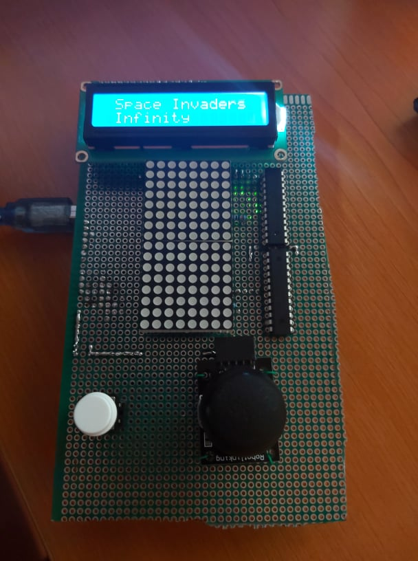

# Space Invaders Infinity
## About the game

Space Invaders Infinity is a 8x16 LED Matrix Arduino game which expands the original Space Invader's mechanics. 
It is also called Infinity because after beating 5 levels, the player can choose to continue playing until he loses all the lives.

## Game specifications

The game has a scoring system where you get points for destroying enemy ships, bonus score for clearing levels without taking damage, 

The difficulty of the game will increase with each level. Enemies will travel faster towards you.

First two highscores will be saved in EEPROM, and the game will feature buying lives with score after beating one level.

## How to play

The main menu is controlled using the joystick. Up and down cycles through menus, and pressing the button enters the shown menu.

### Play Game

Here the game is controlled using the X-axis of the joystick. Pressing the button will shoot bullets from the center of the ship at the bottom of the screen, which is **the ship you are controlling**. Enemies will come flying from top to bottom, at increasing speeds. After each level you will be prompted with a shop, which asks if you want to buy a life for 1000 score. This is a hard choice, since 1000 score is quite a lot.

Defeat 5 levels and you enter infinity level, where enemies come down endlessly, or until you die. Every 15 enemies defeated, the enemy ships movement speed increases. Every 50 enemies defeated, you get to the shop.

### Settings

**to be implemented**

### Highscore

This shows the best 2 scores. The scores are saved on EEPROM, so the highscores remain saved even after you restart the arduino.
To exit, swipe jostick to left.

### Info

**implemented but causes memory issues if enabled**

## Hardware components
1. Arduino Uno
2. 8x8 LED matrix
3. Joystick
4. Button
5. MAX7219 Driver
6. PCB Board
7. Wires
8. Capacitors and resistors

## Image 

