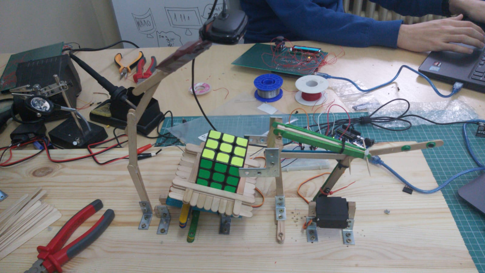

# Rubik Cube Solver
## About the project

This is my final project for the Introduction to Robotics course. It is a robot that scans and solves a Rubik Cube.

## Project specifications

[Bill of Material](https://docs.google.com/spreadsheets/d/1Htry010sDG5Vxl1XxuDkIDsEU6a6pIBbHVVmY9l-o_E/edit#gid=872283192)

I will split this project in two parts: hardware and software.

### Hardware

#### Hardware components

1. Arduino Uno
2. 2 x MG996R Servo motors
3. Logitech C525 webcam
4. Wires
5. Breadboard

#### Other components

1. Lots of icecream sticks
2. Piece of hardwood
3. 10 x L shaped metal

#### How the hardware works

The hardware is quite simple. I use two servo motors: one for the arm, one for the cube holder.

The arm has two functionalities: it can hold the top and middle layer of the cube still, or it can push the cube.

The cube holder has only one functionality: it rotates the cube. If the arm locks the top and middle layer, then the cube holder rotates and the bottom layer moves.

#### Mechanism

The mechanism I used is inspired from a [youtube video](https://www.youtube.com/watch?v=NRRSYEWIQ_w&t=1s) to which I added the webcam feature. Building the arm and everything was more about trial and error than calculating distances and stuff like that. For most pieces, I had at least one more prototype before I stuck to what the project looks like now.

### Software

I used Arduino to control the Servo motors, and Python to detect cube colors and generate the solution.
I used [pySerial](https://pypi.org/project/pyserial/) to communicate between Python script and Arduino board.

My first attempt at recognizing colors was unsuccesful, because I used RGB Color Scheme to detect colors. After some testing, I found out that RGB was not the way to go, so I looked up on the internet and I found [this article](http://kociemba.org/computervision.html) and [this tutorial](https://hcie.csail.mit.edu/classes/2018-fall-6810/6810-opencv-lab.html). By understanding how it works, I modified [Herbert Kociemba's](https://github.com/hkociemba) code to be able to use on my already existing code. 

The cube solution was calculated using [Rubik-Solver Python library](https://pypi.org/project/rubik-solver/).

## How to use

1. Plug Webcam and Arduino into Laptop
2. Run project.py and follow instructions
3. Press space each time the webcam feed shows up and if the colors are corect
4. After all the 6 faces are scanned, the cube will solve itself

## Image 

## Video 

## Used libraries

1. Preinstalled Servo controlling library from Arduino
2. [pySerial](https://pypi.org/project/pyserial/) to communicate between Arduino and Python
3. openCV and [Kociemba's Color Recognition](https://github.com/hkociemba/RubiksCube-TwophaseSolver) for recognizing cube colors
4. [rubik-solver](https://pypi.org/project/rubik-solver/) to calculate Rubik Cube solution
