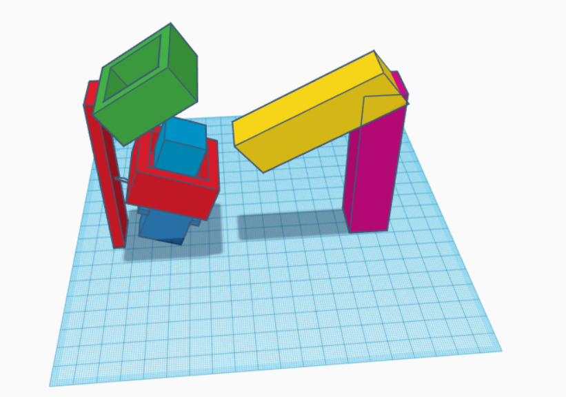

The idea is this: 
The cube stands in the red box(the rubik's cube is the blue box, and the red box should only cover the bottom layer of the cube), and the green box has a motor that can rotate and cover the top two layers of the cube. After which, the red box can rotate using another motor, and because the green box keeps the top and middle layer in place, it will only rotate the bottom layer. 

What are the yellow and purple pillar you may ask. Well, those have two motors. One for the purple pillar to lean towards the cube, and one for the yellow pillar to hit and rotate the cube.

With this in mind, I can manipulate the cube however I want, and rotate the bottom layer, so when I want to rotate the top layer once, I will have to rotate the cube two times using the pillars, and then rotate the bottom layer using the red box.

Another idea is to have the green box at the end of the yellow pillar, and be like some kind of claw which can also push, but also lock the first two layers of the cube in place. ( this idea gets rid of a motor )
